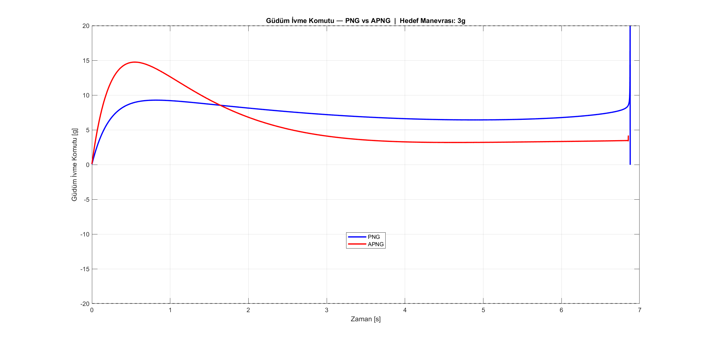

[README.md](https://github.com/user-attachments/files/26077085/README.md)
# PNG vs APNG — 2D Missile Guidance Simulation

Bu proje, iki farklı füze güdüm yöntemini — **PNG** (Proportional Navigation Guidance) ve **APNG** (Augmented PNG) — aynı senaryo üzerinde karşılaştıran bir MATLAB simülasyonudur.

---

## Ne Yapıyor?

Kafa kafaya yaklaşan iki füze simüle ediliyor. Hedef füze Y ekseninde sabit ivmeyle manevra yapıyor, güdüm füzesi ise bunu yakalamaya çalışıyor. Simülasyon her iki güdüm yöntemi için ayrı ayrı koşturulup ıskalama mesafesi (miss distance) karşılaştırılıyor.

---

## PNG ve APNG Arasındaki Fark

**PNG**, görüş hattının (LOS) ne kadar hızlı döndüğüne bakarak manevra komutu üretiyor. Hedefin ne yaptığını bilmesine gerek yok.

**APNG** ise buna ek olarak hedefin ivmesini de hesaba katıyor. Bu sayede hedefin kaçma manevralarını önceden öngörerek daha erken düzeltme yapabiliyor.

```
PNG  →  AM = N · Vc · λ̇
APNG →  AM = N · Vc · λ̇ + (N/2) · (ZEM / tgo²)
```

ZEM (*Zero Effort Miss*): "Şu an hiç manevra yapmazsam ne kadar ısklarım?" sorusunun cevabı.

---

## Simülasyon Özellikleri

- 2B kinematik model (Euler entegrasyonu, T = 1 ms)
- Birinci derece gecikme modeli (τ = 0.2 s) — füze komuta anında tepki veremiyor
- İvme sınırlama (20g) — fiziksel limit
- Hız normalizasyonu — her iki platform sabit hızda uçuyor
- 1g ile 10g arasında otomatik manevra seviyesi taraması

---

## Senaryo Parametreleri

| Parametre | Değer |
|---|---|
| Güdüm füzesi hızı | 900 m/s |
| Hedef füze hızı | 600 m/s |
| Navigasyon sabiti (N) | 4 |
| Başlangıç mesafesi | 10 000 m |
| Y ofseti | 1 000 m |
| Füze zaman sabiti (τ) | 0.2 s |
| Maks. ivme limiti | 20g |

---

## Sonuçlar

| Hedef Manevrası | PNG Miss Distance | APNG Miss Distance |
|---|---|---|
| 3g | 0.87 m | 0.21 m |
| 6g | 1.07 m | 0.91 m |
| 10g | 204.5 m | 17.6 m |

10g manevrada PNG pratikte işlevsiz kalırken APNG makul bir performans sunmaya devam ediyor.

---

## Grafikler

### 2B Uçuş Yörüngesi (3g)


### Güdüm İvme Komutu (3g)


### Manevra Seviyesi Taraması (1g - 10g)


---

## Nasıl Çalıştırılır?

1. MATLAB'ı açın
2. `png_vs_apng_v7.m` dosyasını çalıştırın
3. Command Window'da PNG ve APNG sonuçları, ardından manevra taraması otomatik çıkar
4. 3 grafik açılır

Farklı manevra seviyeleri test etmek için dosyanın başındaki `aTmax` parametresini değiştirin:

```matlab
aTmax = 3 * g;   % 3g, 6g, 10g gibi değerler deneyin
```

---

## Referans

Zarchan, P., *Tactical and Strategic Missile Guidance*, 6. Baskı, AIAA, 2012.
